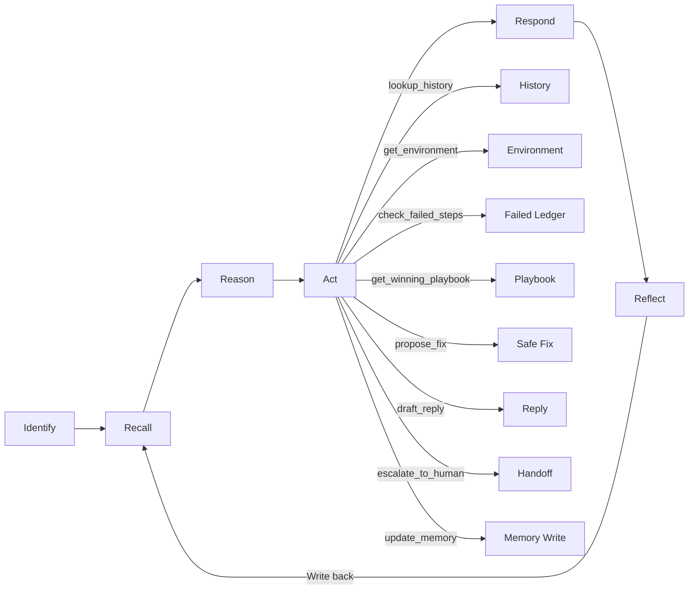
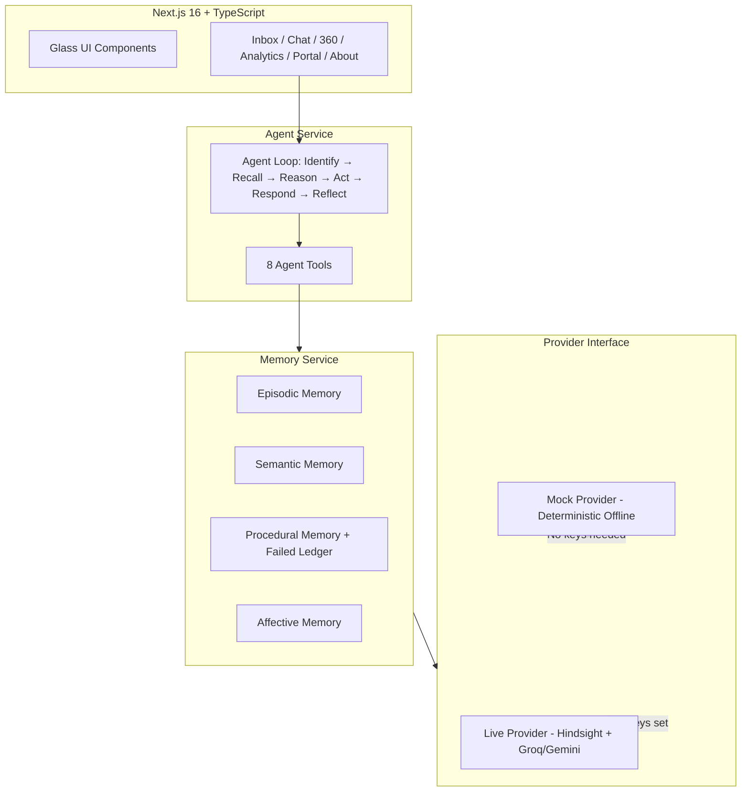

<div align="center">

# ✨ Remi

**Support that remembers.**

[](https://github.com/RupaHasini-04/remi)
[](https://nextjs.org)
[](https://www.typescriptlang.org)
[](./LICENSE)

*Nothing angers a customer more than repeating their story.*

[Live Demo](https://remi-2.netlify.app/) · [GitHub Repository](https://github.com/RupaHasini-04/remi)

</div>

---

## 🔥 The Problem

Every time a customer contacts support, they start from scratch. Their history, their environment, their frustration, the three fixes that already failed — all lost. The agent asks them to "clear your cache" for the fourth time, and the customer starts looking for competitors.

## 💡 The Solution

**Remi** is an AI customer support agent with four layers of persistent memory. It remembers every interaction, every fix that worked, every fix that failed, and even how frustrated the customer is. It never re-suggests a failed solution, never asks for information it already has, and adjusts its tone to match the customer's communication style.

The result? Customers feel heard. Agents resolve issues faster. Churn drops.

---

## 📋 Features

| Feature | What it does | Why it matters |
|---------|-------------|----------------|
| **Four Memory Layers** | Episodic, Semantic, Procedural, Affective | Complete customer context at a glance |
| **10-Second Briefing Card** | Who, what happened, what failed, what worked, mood, how to talk, next move | Agent is prepared before typing a word |
| **Failed-Solutions Ledger** | Tracks every fix that failed per customer | Never re-suggests a failed step (unit-tested) |
| **Winning Playbook** | Database of fixes that worked, ranked by success count | Suggests proven solutions first |
| **Frustration Meter** | Liquid-glass wave animation tracking frustration trajectory | Visual early warning for churn risk |
| **Agent Reasoning Trace** | Identify → Recall → Reason → Act → Respond → Reflect | Full transparency into AI decision-making |
| **AI Reply Copilot** | Style-matched, memory-cited, tone-adjustable drafts | "Memory-safe" badge: never asks for known info (unit-tested) |
| **Assist & Autopilot Modes** | Manual review or auto-send with escalation | Flexibility for different support workflows |
| **Customer 360** | Environment fingerprint, communication style, full memory view | Everything about a customer in one place |
| **Ticket Inbox** | SLA + frustration sorting, priority indicators | Critical issues surface first |
| **Analytics Dashboard** | Time saved, memory hits, satisfaction metrics | Quantified impact (simulated demo data) |
| **Customer Portal** | "We Remember" panel with view/correct/delete controls | Transparency and consent |
| **Demo Mode** | One-click scripted 60-second scenario | Zero-error demonstration |

---

## 🧠 How It Works

### Four Memory Layers

| Layer | What it stores | Example |
|-------|---------------|---------|
| **Episodic** | Tickets, messages, outcomes | "Billing sync failed 4 times over 6 months" |
| **Semantic** | Environment, plan, preferences, facts | "Windows 11, Chrome 140, Business plan" |
| **Procedural** | Winning fixes + Failed-Solutions Ledger | "Cache clear ✗, Webhook fix ✓" |
| **Affective** | Frustration trajectory, communication style | "Level 9/10, prefers concise responses" |

### Agent Loop



---

## 🏗️ Architecture



---

## 🛠️ Tech Stack

| Layer | Technology |
|-------|-----------|
| Frontend | Next.js 16, TypeScript 5, Tailwind CSS 4 |
| Animation | Framer Motion |
| Design | Glassmorphism + liquid glass, Aurora mesh background |
| Fonts | Sora (headings), Inter (body) |
| Agent | Deterministic mock provider (live: Hindsight + Groq/Gemini) |
| Testing | Node.js built-in test runner |

---

## 🚀 Quick Start

```bash
# Clone
git clone https://github.com/RupaHasini-04/remi
cd remi

# Install and run (mock mode — no API keys needed)
npm install && npm run dev
```

Open [http://localhost:3000](http://localhost:3000).

### Environment Variables

Copy `.env.example` to `.env.local`. **All keys are optional** — Remi works in demo mode with no API keys.

| Variable | Required | Description |
|----------|----------|-------------|
| `HINDSIGHT_API_KEY` | No | Hindsight Cloud for persistent memory |
| `GROQ_API_KEY` | No | Groq for live LLM responses |
| `GEMINI_API_KEY` | No | Alternative to Groq |
| `NEXT_PUBLIC_MOCK_MODE` | No | `true` (default) = offline demo mode |

---

## 🎬 Demo Script (3 minutes)

1. **Pain** — Open the Inbox. Notice Priya Sharma's critical billing ticket with frustration 9/10 and SLA warning. Click it.

2. **Recall** — The 10-Second Briefing Card loads instantly: 4th billing sync failure, 3 failed fixes listed with strikethrough, 1 winning fix highlighted, and "Very frustrated — high churn risk."

3. **Failed-Fix Block + Winning Playbook** — Send a message. Watch the Agent Reasoning panel: it checks the Failed-Solutions Ledger, finds 3 failed steps, and proposes only safe alternatives. The reply never re-suggests cache clearing or re-linking.

4. **Frustration Reaction** — The Frustration Meter shows 9/10 with a pulsing red glow. The reply opens with empathy: "I completely understand your frustration, Priya."

5. **Style-Matched Reply + Memory Updated** — The AI Reply Copilot shows a concise reply (matching Priya's style), with memory citations (TKT-4818, TKT-4821, TKT-4830). The "Memory-safe" badge confirms no redundant questions. Click "Send Reply." Toast: "Memory updated: 2 new items."

6. **Analytics** — Switch to Analytics. Animated counters show 847 minutes saved, 89 repeat questions prevented, 94% satisfaction. All labeled "simulated demo data."

7. **Portal** — Switch to Portal. The "We Remember" panel shows stored data with edit/delete controls.

---

## 🧪 Testing

```bash
# Run unit tests
npm test
```

Tests verify two critical properties:

1. **Failed-step blocking** (9 tests): Failed solutions are never re-suggested for the same customer and category. Case-insensitive. Cross-customer isolation.

2. **Memory-safe replies** (6 tests): Replies never ask for information already stored in semantic memory (OS, browser, plan, app version).

---

## 📊 Results

> **All values below are simulated demo data** — clearly labeled in the UI.

| Metric | Value |
|--------|-------|
| Average resolution time | 18.5 minutes |
| Time saved via memory recall | 847 minutes |
| Repeat questions prevented | 89 |
| Customer satisfaction | 94% |
| Memory hit rate (Procedural) | 95% |
| Failed solutions tracked | 3 per hero customer |
| Frustration reduction | 32% average |

---

## 🔒 Privacy & Ethics

- **Synthetic data only** — All 12 customers, 40+ tickets, and memory items are fictional. No real PII.
- **Consent controls** — The Customer Portal includes view, correct, and delete controls for stored data.
- **Transparency** — The Agent Reasoning Trace shows exactly what memory was recalled and how it influenced the response.
- **Data sovereignty** — In production, customers control their data with export and full deletion.

---

## 🗺️ Roadmap

- [ ] Zendesk / Freshdesk integrations
- [ ] pgvector semantic memory for similarity search
- [ ] Multilingual support
- [ ] Voice channel with real-time memory injection
- [ ] Fine-tuned frustration detection model
- [ ] A/B testing for de-escalation playbooks

---

## 👥 Meet Team Zenith

| Name | Role |
|------|------|
| **Rupa Hasini** | Team Lead |
| Pravallika | Frontend |
| Shruthi | Backend |
| Madhurima | AI Integrator |
| Tasneem | Deployment & Integration |

Built with care at HackWithHyderabad3.0.

---

## 🙏 Credits

Started from [siddhartha3066/customer-support-memory-agent](https://github.com/siddhartha3066/customer-support-memory-agent). Remi substantially extends it: new Next.js frontend, four-layer memory, Failed-Solutions Ledger, frustration engine, agent reasoning trace, customer portal and analytics.

New code is credited to Team Zenith. The original LICENSE file is preserved untouched.
